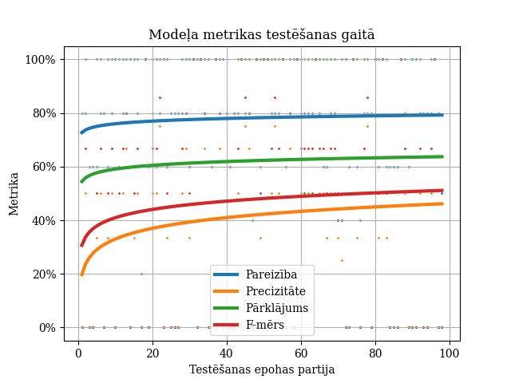

# :latvia: Automatic Neologism Detector
Automatic neologism detector for Latvian language.
Author: Pavels Ivanovs

## Description

This is Pavels Ivanovs' project for bachelor thesis _Automatic Neologism Detection_ [[1]](#1).

The goal of this project is to create a NLP tool which extracts from the submitted text words which are most likely 
to be included into the vocabulary of Latvian language, specifically, [Tēzaurs.lv](https://tezaurs.lv/):  the biggest publicly 
available thesaurus of Latvian language.

## Methodology

Two main approaches are used to achieve the goal of the project:
1. **Exclusion lists**. Words from the input text are being filtered out if their lemmas are located in the vocabulary. 
Lemmatization functionality provided by [_LVTagger_](https://github.com/PeterisP/LVTagger) and 
[_NLP-PIPE_](https://github.com/LUMII-AILab/nlp-pipe).
2. **Classification by machine-learning model**. Classification using neural network. Input features, like word length, 
Levenshtein distance to the closest vocabulary entry, are being extracted from the word which are being fed to the 
neural network which outputs a possibility of a word being included into the vocabulary.

## Results

After training the model its efficiency is as follows (x-axis: batch number; y-axis: metric):

- Accuracy (_Pareizība_): 42.70%
- Precision (_Precizitāte_): 22.96%
- Recall (_Pārklājums_): 59.02%
- F-score (_F-mērs_): 31.76%

Based on the metrics received from testing the model it is seen that there are still ways to improve the efficiency 
of the model. Two main options: optimization of the dataset (oversampling and overall increase of records) and model 
optimization, including neural network strucure changes and additional experimenting with epoch number and 
learning rate.

## Requirements
- Python v3.10
- Docker compose

## References
<a id="1">[1]</a> P. Ivanovs, "Jaunvārdu automātiska atpazīšana," Bakalaura darbs, Datorikas fakultāte, Latvijas Universitāte, Rīga, 
Latvija, 2023
